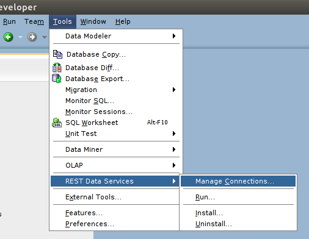
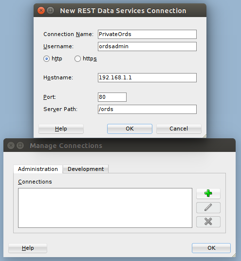
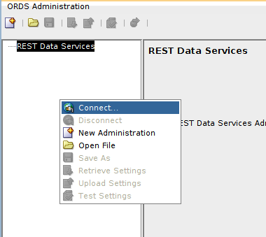
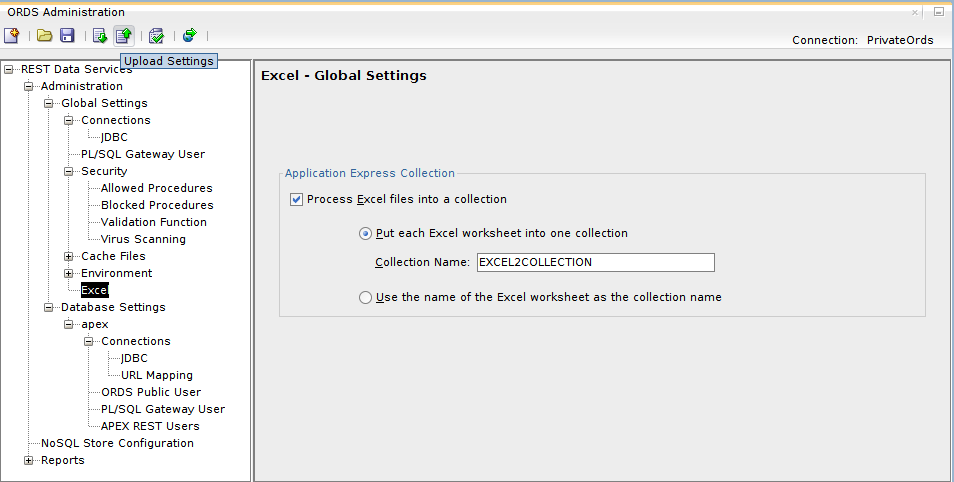

# Administering ORDS

There are a few ways to configure ORDS.

1. Editing the configuration file(s)
* On the command line
* Through SQL Developer

## Editing the configuration file(s)

On the server, you can edit the configuration file directly by editing the file `/etc/ords/defaults.xml`. If you are ever unsure where the config file is stored, you can find out by running the following command:

```bash
java -jar /usr/share/tomcat/webapps/ords.war configdir
```

For a full list of settings and their purpose, refer to [Table A-1](http://docs.oracle.com/cd/E56351_01/doc.30/e56293/config_file.htm#AELIG7204) in the book `Oracle REST Data Services Installation, Configuration, and Development Guide`.

So, open the file with your preferred text editor, and update the values accordingly.

```bash
vi /etc/ords/defaults.xml
```

After you have finished updating the file, you will need to re-deploy ORDS. This is achieved by restarting tomcat with the following command.

```bash
systemctl restart tomcat
```

## On the command line

You can use the ords.war tool to update invidual properties by using the `set-property` command.

```bash
java -jar /usr/share/tomcat/webapps/ords.war help set-property
```
Which tells us:
```
java -jar ords.war set-property [--conf] <name> <value>

Options:
           [--conf]              The name of the configuration
                                 to edit, default value is:
                                 defaults

Arguments:
           <name>                The name of the configuration
                                 setting

           <value>               The value of the
                                 configuration setting
```

So, for example, if we wanted to enable caching, we would run the command:

```bash
sudo java -jar /usr/share/tomcat/webapps/ords.war set-property cache.caching true
```
Giving the following confirmation
```
May 08, 2015 6:53:25 PM oracle.dbtools.rt.config.setup.SetProperty execute
INFO: Modified: /etc/ords/defaults.xml, setting: cache.caching = true
```

## SQL Developer

To be able to configure ORDS 3 through SQL Developer, you will need to be running version 4.1 or later. First you will need to configure an administrator that you can log in with. You can do this in the server by running the following command:

```bash
sudo java -jar /usr/share/tomcat/webapps/ords.war user ordsadmin "Listener Administrator"
```
Where `ordsadmin` is the desired user name and `Listener Administrator` is the desired role.

Once you run the above command, you will be prompted to give the user a password.

If you are not on HTTPS, you will need to add the `security.verifySSL` entry to the ORDS configuration and set the value false. Do so by running the following command:

```bash
sudo java -jar /usr/share/tomcat/webapps/ords.war set-property security.verifySSL false
```

Alternatively, edit the configuration file (`/etc/ords/defaults.xml`) and set the value of the entry security.verifySSL to false as described in the docs: http://docs.oracle.com/cd/E56351_01/doc.30/e56293/install.htm#AELIG7183

After that is all done, open SQL Developer and create a connection to your server. Do this by going to the Tools menu, REST Data Services, Manage Connections...



Whilst you are focused on the Administration tab, click the plus arrow to add a new connection, enter the details and click OK.



Then, you will want to display the ORDS Administration window. This is opened by going to the View menu, REST Data Services and then Administration. Once opened, right click inside the left hand pane, and then Connect...



Here, you will select the connection created in the previous step, where you will then be prompted to enter the login details you created earlier on.

These settings relate to what is stored in the configuration. This is important because the database connection settings (Global Settings, Connections and  Database Settings, apex, Connections) relate to how they are on the server. So by default, the server will be loaded as localhost which represents the server - but when validating the settings, it's treating localhost as your machine. One way around this is to create an `ssh` port forward tunnel:

```bash
ssh -L 1521:localhost:1521 <user>@<server>
```

Then the settings will be properly validated.

You can push these settings back to the server by pushing the `Upload Settings` toolbar button.



Please refer to the Chapter [`Oracle Rest Data Services Support`](https://docs.oracle.com/cd/E55747_01/appdev.41/e55591/ords_sqldev.htm#RPTUG45951) in the SQL Developer Users guide for more information about using SQL Developer to manage the REST settings.
